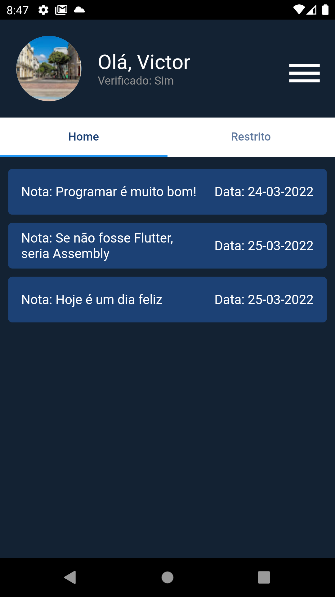

<h1 align="center">
    Desafio Capyba App
</h1>

<span>
<div align="center">




</div>
</p>

# Projeto

Foi proposto pela Capyba Software como um teste de capacitação para recrutamento de novos desenvolvedores mobile, o projeto em si demonstra operações básicas, como: login, logout, cadastro e controle de acesso entre áreas da aplicação a partir de verificação por email.

# Tecnologias

- Flutter
- Firebase

### Executar aplicação em desenvolvimento:
```
$ flutter pub get
$ flutter run
```
